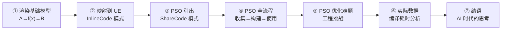
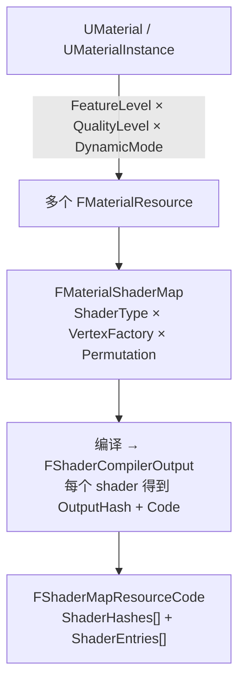
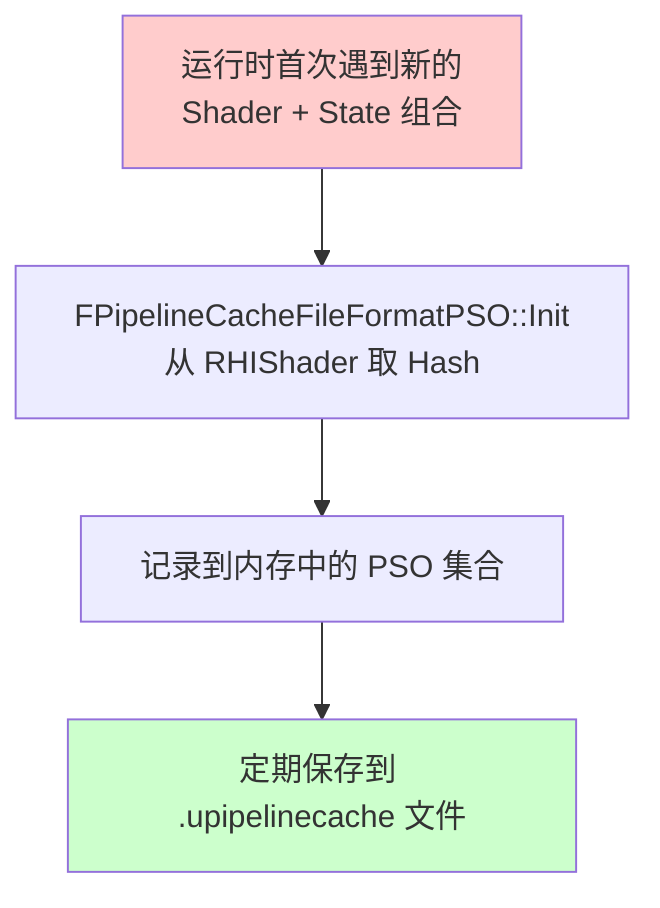
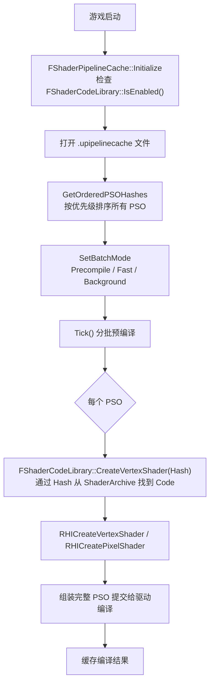
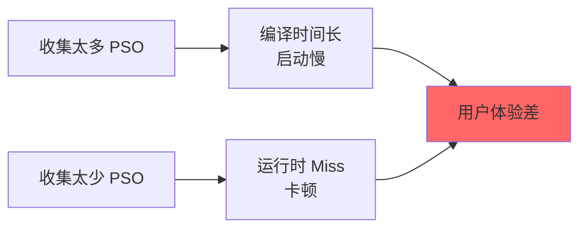
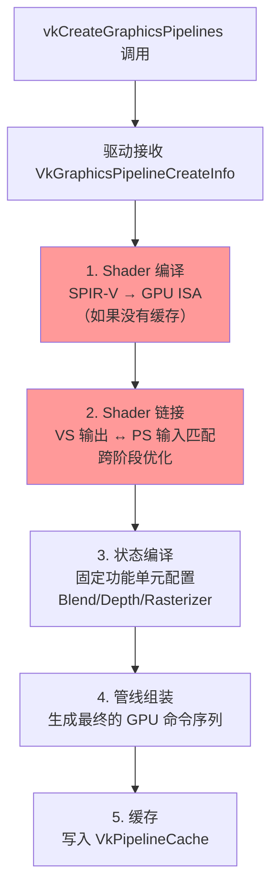
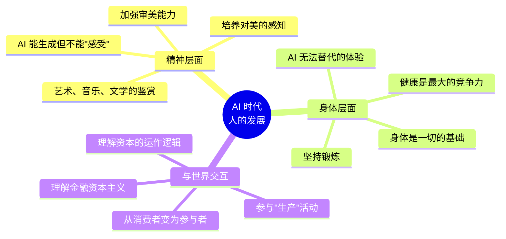

# UE Shader 管线与 PSO 优化 —— PPT 分享大纲

> **分享主题**：从一个简单的渲染函数出发，理解 UE Shader 管线、PSO 缓存机制与优化实践
> **核心隐喻**：渲染本质上就是 `A → f(x) → B`，输入是顶点数据，函数是 Shader + 管线状态，输出是像素/Buffer
> **预计时长**：60-90 分钟

---

## 整体脉络

```
简单渲染模型 → OpenGL/Vulkan 对比 → UE InlineCode → PSO 引出 ShareCode → PSO 全流程 → PSO 优化难题 → 实际数据 → 结语
```



---

## 第一章：渲染的本质 —— A → f(x) → B

### 1.1 核心模型

**PPT 第一页**：一个极简的流程图

```
顶点数据 (A) ──→ [ Shader函数 f(x) + 管线状态参数 ] ──→ 像素/Buffer (B)
```

- **A（输入）**：顶点位置、法线、UV、颜色等
- **f(x)（函数）**：Shader 程序（VS/PS/GS/CS...）
- **管线状态（参数）**：混合模式、深度测试、光栅化设置、RenderTarget 格式等
- **B（输出）**：屏幕像素、深度 Buffer、G-Buffer 等

> **要点**：Shader 是"做什么计算"，管线状态是"怎么做这个计算"，两者合在一起才是完整的渲染管线。

### 1.2 OpenGL 的渲染例子

**需要准备的代码示例**：一个最简单的 OpenGL 三角形渲染

```
关键步骤：
1. glCreateShader / glCompileShader → 编译 VS/PS
2. glCreateProgram / glLinkProgram  → 链接成 Program
3. glEnable(GL_DEPTH_TEST) / glBlendFunc(...) → 设置管线状态（零散的全局状态）
4. glDrawArrays → 提交绘制
```

**要强调的点**：
- OpenGL 的管线状态是**全局的、零散的**，每次 Draw 前手动设置
- Shader 编译是**运行时**的（glCompileShader）
- 驱动在 Draw 时才真正"组装"完整管线 → **延迟编译，可能卡顿**

### 1.3 Vulkan 的渲染例子

**需要准备的代码示例**：同样的三角形，用 Vulkan 实现

```
关键步骤：
1. vkCreateShaderModule → 加载预编译的 SPIR-V
2. VkGraphicsPipelineCreateInfo → 一次性描述完整管线：
   - Shader Stages (VS/PS)
   - Vertex Input State
   - Rasterization State
   - Depth/Stencil State
   - Blend State
   - RenderPass / Subpass
3. vkCreateGraphicsPipelines → 创建 PSO（Pipeline State Object）
4. vkCmdBindPipeline + vkCmdDraw → 绑定 PSO 并绘制
```

**要强调的点**：
- Vulkan 要求**提前声明完整的管线状态**（PSO）
- 创建 PSO 是一个**重操作**（驱动需要编译、链接、优化）
- 一旦创建好，运行时绑定 PSO 非常快
- **这就是 PSO 缓存存在的根本原因**

### 1.4 对比表格（PPT 用）

| 维度 | OpenGL | Vulkan / Metal / D3D12 |
|------|--------|------------------------|
| 管线状态 | 全局零散设置 | **PSO 一次性打包** |
| Shader 编译 | 运行时编译 GLSL | 预编译 SPIR-V / MSL / DXIL |
| 管线创建时机 | Draw 时隐式创建 | **显式提前创建** |
| 首次 Draw 卡顿 | 可能（驱动延迟编译） | **可能（PSO 创建耗时）** |
| 解决方案 | Warm-up Draw | **PSO Cache / 预编译** |

### 需要准备的材料
- [ ] 一个简单的 OpenGL 渲染三角形的代码片段（约 30 行关键代码）
- [ ] 一个简单的 Vulkan 渲染三角形的代码片段（重点展示 VkGraphicsPipelineCreateInfo 的结构）
- [ ] 一张 `A → f(x) → B` 的流程图（逐步展开版本，从简单到复杂）

---

## 第二章：映射到 UE —— InlineCode 模式

### 2.1 UE 中的 A → f(x) → B

将第一章的模型映射到 UE 的概念：

| 通用模型 | UE 对应 | 说明 |
|----------|---------|------|
| A（输入） | VertexFactory（FLocalVertexFactory, FGPUSkinVertexFactory...） | 定义顶点数据布局 |
| f(x)（Shader） | FShader（TBasePassPS, TShadowDepthVS...） | 具体的着色器程序 |
| 管线状态 | BlendState + RasterizerState + DepthStencilState + RenderTarget 格式 | 渲染状态 |
| B（输出） | RenderTarget / G-Buffer / ShadowMap | 渲染结果 |

### 2.2 Material → FMaterialResource → ShaderMap 的编译链



**关键代码引用**（来自教程文档）：
- `UMaterial::CacheResourceShadersForCooking` — 遍历 QualityLevel × DynamicMode 组合
- `FShaderMapResourceCode::AddShaderCompilerOutput` — 收集编译产物
- `FShaderMapResourceCode::Finalize` — 计算 ResourceHash

### 2.3 InlineCode 模式的存储与加载

```
┌─────────────────────────────────────┐
│           uasset 文件               │
│  ┌─────────────────────────────┐    │
│  │  FrozenContent (元数据)      │    │
│  │  - ShaderType 信息           │    │
│  │  - VertexFactory 信息        │    │
│  │  - Permutation 信息          │    │
│  ├─────────────────────────────┤    │
│  │  ShaderCode (二进制字节码)    │    │
│  │  - VS code                   │    │
│  │  - PS code                   │    │
│  │  - GS code (如果有)          │    │
│  └─────────────────────────────┘    │
└─────────────────────────────────────┘
```

- Cook 时：`FShaderMapBase::Serialize` 的 `bShareCode=false` 分支，ShaderCode 直接写入 uasset
- 运行时：从 uasset 反序列化，创建 `FShaderMapResource_InlineCode`
- 渲染时：`FShader::ResourceIndex`（本地索引）→ `Code->ShaderEntries[index]` → `RHICreateShader`

### 2.4 InlineCode 的问题

> **核心问题**：100 个材质用了同一个 BasePass VS，这个 VS 的 code 就存了 100 份！

- 包体膨胀（尤其手游）
- 无法支持 PSO 预编译（后面详述）

### 需要准备的材料
- [ ] UE 中一个简单材质的 ShaderMap 内容截图（可以用 ShaderMap 调试工具）
- [ ] InlineCode 模式下 uasset 文件大小 vs ShareCode 模式的对比数据
- [ ] `FShaderMapResource_InlineCode::CreateRHIShader` 的关键代码片段

---

## 第三章：PSO 引出 ShareCode 模式

### 3.1 从 PSO 的需求反推

**PPT 叙事逻辑**：不要直接讲 ShareCode，而是从 PSO 的需求出发：

```
问题：Vulkan/Metal 创建 PSO 很慢 → 需要预编译
  ↓
预编译需要什么？→ 需要通过 ShaderHash 找到 ShaderCode
  ↓
InlineCode 能做到吗？→ 不能！Code 散落在各个 uasset 中，没有全局索引
  ↓
解决方案：ShareCode 模式 → 全局 ShaderArchive（.ushaderbytecode）
```

### 3.2 ShareCode 模式的核心变化

| | InlineCode | ShareCode |
|---|---|---|
| **uasset 中存什么** | FrozenContent + 完整 ShaderCode | FrozenContent + **仅 ResourceHash** |
| **ShaderCode 存哪** | uasset 内部 | **全局 .ushaderbytecode 文件** |
| **Code 去重** | ❌ 无去重 | ✅ 全局去重 |
| **PSO 预编译** | ❌ 不支持 | ✅ 支持 |

### 3.3 ShaderArchive 的两层索引架构

```
FShader (本地索引 2)
    ↓ GetShader(2)
FShaderMapResource_SharedCode (ShaderMapIndex = 5)
    ↓ GetShaderIndex(5, 2)
ShaderMapEntries[5].ShaderIndicesOffset + 2 = 102
    ↓
ShaderIndices[102] = 305 (全局索引)
    ↓
ShaderEntries[305] → 实际 Shader Code
```

**为什么用本地索引而不是全局索引？**
1. 增量 Cook 的稳定性 — 全局索引变了不需要重新序列化所有 uasset
2. uasset 与 ShaderArchive 解耦
3. InlineCode/SharedCode 统一接口（策略模式）

### 3.4 包体优化效果

> 这里需要准备实际项目的数据

### 3.5 涉及的关键文件

| 文件 | 作用 |
|------|------|
| `ShaderCodeLibrary.cpp` | ShareCode 的核心管理器，提供全局 Hash→Code 查找 |
| `ShaderCodeArchive.h` | `FSerializedShaderArchive` 定义，ShaderArchive 的内部结构 |
| `ShaderResource.cpp` | `FShaderMapResourceCode` 的序列化和 RHI Shader 创建 |
| `ShaderMap.cpp` | `FShaderMapBase::Serialize` — InlineCode/ShareCode 分支 |
| `ShaderPipelineCache.h/cpp` | PSO 缓存系统的核心 |
| `PipelineFileCache.h/cpp` | PSO 文件缓存的 RHI 层实现 |
| `*.ushaderbytecode` | 全局 Shader 归档文件（运行时） |
| `*.upipelinecache` / `*.spc` | PSO 缓存文件（运行时） |

### 需要准备的材料
- [ ] 项目中 InlineCode vs ShareCode 的包体大小对比数据
- [ ] `.ushaderbytecode` 文件的实际大小
- [ ] `FShaderCodeLibrary::IsEnabled()` 的检查代码截图

---

## 第四章：PSO 全流程 —— 收集、构建、使用

### 4.1 PSO 中存了什么

```cpp
struct FPipelineCacheFileFormatPSO {
    struct GraphicsDescriptor {
        FSHAHash VertexShader;      // 单个 VS 的 hash
        FSHAHash FragmentShader;    // 单个 PS 的 hash
        // ... 其他 shader stages
        FBlendStateInitializerRHI BlendState;
        FRasterizerStateInitializerRHI RasterizerState;
        FDepthStencilStateInitializerRHI DepthStencilState;
        // ... RenderTarget 格式、MSAA 等
    };
};
```

> **关键**：PSO 存的是**单个 Shader 的 Hash**，不是 ResourceHash！
> 这也是为什么 PSO 需要 ShareCode 的全局 Hash→Code 反查能力。

### 4.2 PSO 收集（Recording）



**收集方式**：
1. **自动收集**：`r.ShaderPipelineCache.LogPSO = 1`，运行时自动记录遇到的 PSO
2. **手动遍历**：通过自动化测试脚本遍历所有关卡/场景
3. **合并工具**：`UnrealEd.MergeShaderPipelineCaches` 合并多次收集的结果

### 4.3 PSO 构建（Build / Precompile）



**BatchMode 三种模式**：
| 模式 | 场景 | 批量大小 |
|------|------|----------|
| `Precompile` | 启动时/Loading 界面 | `r.ShaderPipelineCache.PrecompileBatchSize` |
| `Fast` | Loading 界面 | `r.ShaderPipelineCache.BatchSize` |
| `Background` | 游戏中后台 | `r.ShaderPipelineCache.BackgroundBatchSize` |

### 4.4 为什么 PSO 需要 "Expand 再 Build"

> **这是一个重要的理解点**

**Expand 的含义**：PSO 缓存文件中存储的是"压缩的"描述符（Hash + 状态），在预编译前需要"展开"为完整的 GPU 可用对象：

```
Expand 阶段：
  ShaderHash → 查找 ShaderArchive → 获取 ShaderCode → 创建 RHIShader 对象
  BlendState 描述 → 创建 RHIBlendState 对象
  RasterizerState 描述 → 创建 RHIRasterizerState 对象
  DepthStencilState 描述 → 创建 RHIDepthStencilState 对象

Build 阶段：
  将所有展开后的对象组装成 VkGraphicsPipelineCreateInfo
  调用 vkCreateGraphicsPipelines → 驱动层编译和链接
```

**为什么要分两步？**
1. **Expand 可以并行、可以缓存**：同一个 ShaderHash 对应的 RHIShader 只需创建一次，多个 PSO 可以共享
2. **Build 是真正的重操作**：驱动层的编译和链接是最耗时的部分
3. **分批控制**：Expand 快但占内存，Build 慢但释放 GPU 资源，分开可以更好地控制节奏
4. **错误隔离**：Expand 失败（shader 找不到）和 Build 失败（状态不兼容）是不同类型的错误

### 4.5 PSO 使用（Runtime）

```
运行时渲染 → 查找 PSO 缓存 → 命中 → 直接使用（零延迟）
                            → 未命中 → 实时创建 PSO → 可能卡顿（hitching）
```

### 需要准备的材料
- [ ] PSO 收集的实际操作流程截图/脚本
- [ ] `FShaderPipelineCache::Precompile` 的关键代码片段
- [ ] BatchMode 切换的时序图
- [ ] 项目中 PSO 预编译的日志截图（显示编译数量和耗时）

---

## 第五章：PSO 优化的难题

### 5.1 PSO 是一个"两难问题"



### 5.2 多地图/多场景的挑战

- 不同地图使用不同的材质组合 → PSO 集合不同
- 全量收集 = 所有地图的 PSO 并集 → 编译量巨大
- 按需收集 = 只收集当前地图 → 切换地图时可能 Miss

**可能的策略**：
- 按地图分 PSO 文件
- 使用 `GameUsageMask` 标记不同场景的 PSO
- 优先级排序：高频 PSO 先编译

### 5.3 设备碎片化问题

```
同一个 PSO 描述符，在不同环境下可能产生不同的编译结果：

┌──────────────┬──────────────┬──────────────┐
│   Android    │   Android    │   Android    │
│  Adreno 740  │  Mali-G720   │  PowerVR     │
│  Vulkan 1.3  │  Vulkan 1.1  │  Vulkan 1.2  │
│  Driver v530 │  Driver v42  │  Driver v1.17│
├──────────────┼──────────────┼──────────────┤
│  编译 2.1s   │  编译 4.3s   │  编译 1.8s   │
│  某些 PSO    │  某些 PSO    │  某些 PSO    │
│  可能失败    │  格式不同    │  优化不同    │
└──────────────┴──────────────┴──────────────┘
```

**问题**：
- 不同 GPU 架构对 Shader 的编译优化不同
- 不同驱动版本可能有 Bug 或行为差异
- 某些 PSO 在特定设备上可能编译失败
- **无法用一套 PSO 缓存覆盖所有设备**

### 5.4 预编译时间 vs 用户体验

| 策略 | 优点 | 缺点 |
|------|------|------|
| 启动时全量预编译 | 运行时零卡顿 | 启动时间长（可能 30s+） |
| 分批后台编译 | 启动快 | 前几分钟可能有卡顿 |
| 按需编译 | 最小启动开销 | 随时可能卡顿 |
| Loading 界面编译 | 利用等待时间 | 需要精确控制 Loading 时长 |

### 5.5 一些优化思路

1. **PSO 优先级排序**：按使用频率、首次使用帧排序，优先编译高频 PSO
2. **PSO 去重与合并**：合并多次收集的结果，去除过时的 PSO
3. **异步编译**：利用多线程并行编译 PSO
4. **Shader 预热**：在 Loading 界面提前创建 RHI Shader，减少 Expand 时间
5. **PSO 缓存分层**：基础 PSO（必定使用）+ 场景 PSO（按需加载）
6. **驱动层 Pipeline Cache**：利用 `VkPipelineCache` / Metal Binary Archive 缓存驱动编译结果

### 需要准备的材料
- [ ] 项目中不同地图的 PSO 数量统计
- [ ] PSO 收集覆盖率数据（收集到的 vs 运行时实际遇到的）
- [ ] 不同设备上 PSO 编译失败的案例
- [ ] 启动时间 vs PSO 预编译数量的关系曲线

---

## 第六章：PSO 编译到底在干什么 —— 实际数据与 Mesa 分析

### 6.1 不同设备的 PSO 编译速度对比

> **需要准备实际测试数据**

**建议测试矩阵**：

| 设备 | GPU | 驱动 | PSO 数量 | 总编译时间 | 平均单个 PSO |
|------|-----|------|----------|-----------|-------------|
| 小米 14 | Adreno 750 | v530 | 2000 | ? | ? |
| 三星 S24 | Xclipse 940 | v? | 2000 | ? | ? |
| Pixel 8 | Mali-G715 | v? | 2000 | ? | ? |
| iPhone 15 | A17 Pro | Metal 3 | 2000 | ? | ? |
| PC (RTX 4070) | Vulkan | v537 | 2000 | ? | ? |

### 6.2 PSO 编译的具体步骤（以 Vulkan 为例）



**最耗时的部分**：
1. **Shader 编译（SPIR-V → GPU ISA）**：这是最重的操作，涉及指令选择、寄存器分配、调度优化
2. **跨阶段链接优化**：VS 输出和 PS 输入的匹配、死代码消除
3. 固定功能状态编译相对较快

### 6.3 Mesa 开源驱动的 PSO 编译分析

> Mesa 是 Linux 上的开源图形驱动栈，可以直观看到 PSO 编译的内部实现

**Mesa Vulkan 驱动的 PSO 编译流程**（以 RADV/AMD 为例）：

```
SPIR-V 字节码
    ↓ spirv_to_nir()          — SPIR-V → NIR（Mesa 的中间表示）
    ↓ nir_optimize()          — 通用优化 Pass（常量折叠、死代码消除、循环优化...）
    ↓ nir_lower_*()           — 硬件相关的 Lowering（纹理指令、内存访问模式...）
    ↓ nir_to_aco() / nir_to_llvm()  — NIR → GPU ISA（ACO 编译器 或 LLVM 后端）
    ↓ aco_compile() / llvm_compile() — 指令选择 + 寄存器分配 + 调度
    ↓ 二进制 GPU 指令
```

**耗时分布（典型）**：
| 阶段 | 耗时占比 | 说明 |
|------|---------|------|
| SPIR-V → NIR | ~5% | 格式转换，较快 |
| NIR 优化 | ~15-25% | 多轮优化 Pass |
| NIR Lowering | ~10% | 硬件适配 |
| **ISA 编译（ACO/LLVM）** | **~50-60%** | **最耗时！寄存器分配和指令调度** |
| 管线组装 | ~5-10% | 固定功能配置 |

**关键洞察**：
- **寄存器分配**是编译中最复杂的部分（NP-hard 问题的近似求解）
- **指令调度**需要考虑 GPU 的 SIMD 宽度、延迟隐藏、Bank Conflict 等
- Mesa 的 ACO 编译器比 LLVM 后端快 2-3x，因为它是专门为 GPU 设计的
- `VkPipelineCache` 可以缓存编译结果，**第二次创建同样的 PSO 几乎是瞬时的**

### 6.4 为什么 VkPipelineCache 不能完全解决问题

- `VkPipelineCache` 是**设备本地的**，不能跨设备共享
- 首次安装/驱动更新后，缓存失效，需要重新编译
- 缓存文件可能很大（几十 MB）
- 某些驱动的缓存实现有 Bug

### 需要准备的材料
- [ ] 不同设备上的 PSO 编译耗时实测数据
- [ ] Mesa RADV 的编译流程图（可以从 Mesa 源码或文档中截取）
- [ ] `VkPipelineCache` 命中 vs 未命中的耗时对比
- [ ] 一个复杂 Shader 的编译耗时 Breakdown（如果能从 Mesa 的 profiling 工具获取）
- [ ] 参考资料：Mesa ACO 编译器的设计文档 (https://gitlab.freedesktop.org/mesa/mesa/-/blob/main/src/amd/compiler/README.md)

---

## 第七章：结语 —— AI 时代的个人发展思考

> **建议**：这一章作为"彩蛋/轻松环节"，控制在 2-3 页 PPT，不要展开太多，保持轻松的氛围。
> 可以用"技术分享的最后，聊点技术之外的"来过渡。

### 7.1 三个维度



### 7.2 核心观点

1. **精神上 —— 加强审美**
   - AI 可以生成内容，但"审美"是人类独有的判断力
   - 能分辨好坏、能定义方向，比能执行更重要
   - 技术人也需要培养对美的感知

2. **身体上 —— 锻炼**
   - 身体是承载一切的硬件，AI 时代更需要好的"硬件"
   - 长期伏案工作的程序员尤其需要

3. **与世界交互 —— 理解金融资本主义**
   - 理解资本的运作逻辑，不只是做技术执行者
   - 参与金融资本主义的"生产"活动（投资、创业、资产配置）
   - 从"被雇佣"到"参与资本运作"的思维转变

### 需要准备的材料
- [ ] 1-2 个有说服力的例子或故事
- [ ] 可以准备一些推荐书单/资源

---

## 补充建议

### 整体节奏建议

| 章节 | 预计时长 | 难度 | 互动建议 |
|------|---------|------|---------|
| ① 渲染基础 | 10-15 min | ⭐⭐ | 可以提问"大家用过 OpenGL/Vulkan 吗？" |
| ② UE InlineCode | 10 min | ⭐⭐⭐ | 展示代码，解释流程图 |
| ③ ShareCode | 10-15 min | ⭐⭐⭐⭐ | 重点讲两层索引，画图辅助 |
| ④ PSO 全流程 | 15 min | ⭐⭐⭐⭐ | 核心章节，需要反复强调 |
| ⑤ PSO 难题 | 10 min | ⭐⭐⭐ | 可以让大家讨论解决方案 |
| ⑥ 实际数据 | 10-15 min | ⭐⭐⭐ | 展示数据，引发讨论 |
| ⑦ 结语 | 5 min | ⭐ | 轻松收尾 |

### 可以补充的内容

1. **Shader Permutation 爆炸问题**：为什么 UE 会产生如此多的 Shader 变体？这直接影响 PSO 数量
2. **Native Shader Libraries**（Metal 特有）：Metal 可以将 Shader 预编译为 metallib，进一步减少运行时开销
3. **UE5 的改进**：如果适用，可以提及 UE5 在 PSO 方面的改进（如 PSO Precaching）
4. **实际项目中的 PSO 工作流**：从开发到上线，PSO 收集和管理的完整工作流

### 建议的 PPT 风格

- 代码片段用**深色背景 + 语法高亮**
- 流程图用 **Mermaid 风格**（简洁清晰）
- 每页 PPT 只讲一个核心概念
- 复杂的索引关系用**动画逐步展开**
- 数据对比用**表格或柱状图**

---

## 需要准备的材料清单（汇总）

### 代码/截图类
- [ ] OpenGL 渲染三角形的简化代码（~30 行）
- [ ] Vulkan 渲染三角形的简化代码（重点展示 VkGraphicsPipelineCreateInfo）
- [ ] UE 中 `FShaderMapResource_InlineCode::CreateRHIShader` 关键代码
- [ ] UE 中 `FShaderMapResource_SharedCode::CreateRHIShader` 关键代码
- [ ] `FPipelineCacheFileFormatPSO` 结构体定义
- [ ] `FShaderPipelineCache::Initialize` 中的 IsEnabled 检查
- [ ] PSO 预编译的运行时日志截图

### 数据类
- [ ] InlineCode vs ShareCode 的包体大小对比
- [ ] 不同设备的 PSO 编译耗时实测数据
- [ ] PSO 收集覆盖率统计
- [ ] 不同地图的 PSO 数量分布
- [ ] VkPipelineCache 命中 vs 未命中的耗时对比

### 参考资料
- [ ] Mesa ACO 编译器文档：https://gitlab.freedesktop.org/mesa/mesa/-/blob/main/src/amd/compiler/README.md
- [ ] Vulkan Pipeline Cache 规范：https://registry.khronos.org/vulkan/specs/1.3-extensions/man/html/VkPipelineCache.html
- [ ] UE 官方文档：PSO Caching（如果有）
- [ ] 你的 ShaderCode 教程文档（作为参考资料附录）
