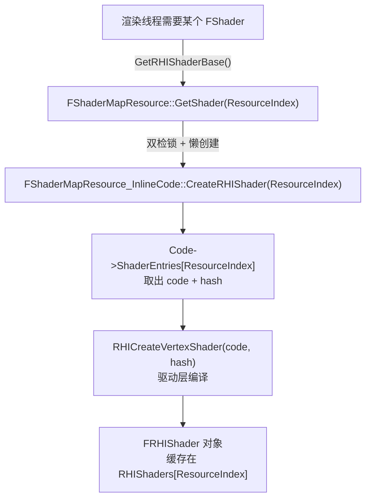
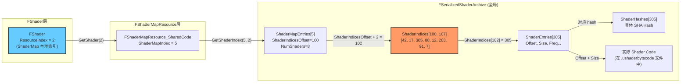
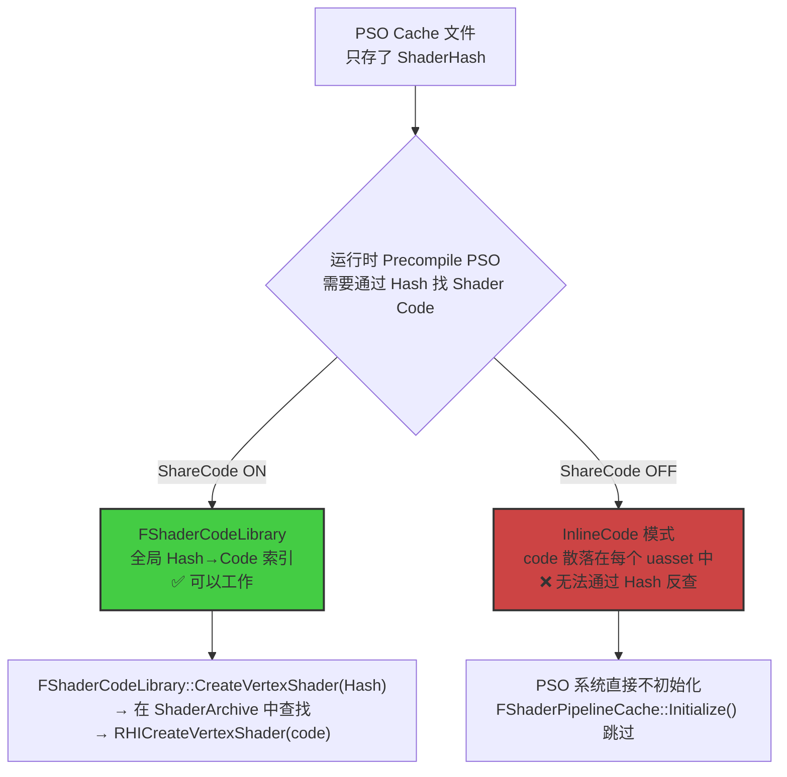
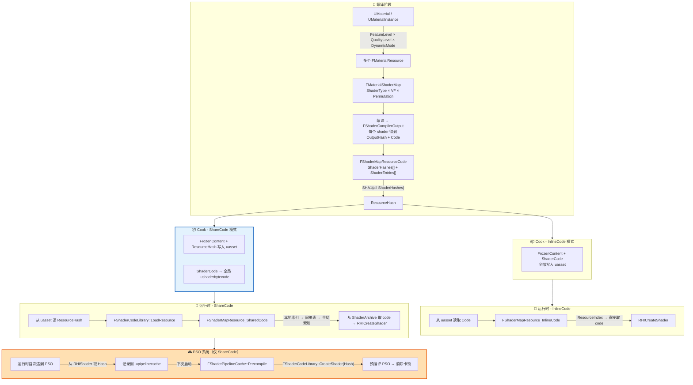

# UE Shader 管线课程：从 InlineCode 到 ShareCode 到 PSO

> **课程目标**：理解 UE 中 Material 如何编译为 Shader、Shader 如何存储和加载、以及 PSO 缓存如何工作。
> 从最简单的 InlineCode（内联）模式讲起，逐步引入 ShareCode（共享代码库）模式，最终理解 PSO 预编译为什么必须依赖 ShareCode。

---

## 第一章：Material 如何变成 Shader

### 1.1 一个 UMaterial 会产出多个 FMaterialResource

Cook 时，一个 UMaterial（或 UMaterialInstance）会根据 **FeatureLevel × QualityLevel × DynamicMode** 的排列组合，创建出多个 `FMaterialResource`。每个 FMaterialResource 代表"这个材质在某个特定条件下的着色器集合"。

**文件**: `Engine/Source/Runtime/Engine/Private/Materials/Material.cpp:3388`

```cpp
void UMaterial::CacheResourceShadersForCooking(
    EShaderPlatform ShaderPlatform, 
    TArray<FMaterialResource*>& OutCachedMaterialResources, 
    const ITargetPlatform* TargetPlatform)
{
    ERHIFeatureLevel::Type TargetFeatureLevel = GetMaxSupportedFeatureLevel(ShaderPlatform);

    TArray<bool, TInlineAllocator<EMaterialQualityLevel::Num>> QualityLevelsUsed;
    GetQualityLevelUsageForCooking(QualityLevelsUsed, ShaderPlatform);

    TArray<EMaterialDynamicMode> ValidateDynamicModes;
    GetValidateDynamicModes(ValidateDynamicModes);

    TArray<FMaterialResource*> NewResourcesToCache;
    // 遍历 QualityLevel × DynamicMode 的所有组合
    for (int32 QualityLevelIndex = 0; QualityLevelIndex < EMaterialQualityLevel::Num; QualityLevelIndex++)
    {
        if (QualityLevelsUsed[QualityLevelIndex])
        {
            for (EMaterialDynamicMode CurMatDynamicMode : ValidateDynamicModes)
            {
                FMaterialResource* NewResource = AllocateResource();
                NewResource->SetMaterial(this, nullptr, 
                    (ERHIFeatureLevel::Type)TargetFeatureLevel, 
                    (EMaterialQualityLevel::Type)QualityLevelIndex);
                NewResource->SetMaterialDynamicMode(CurMatDynamicMode);
                NewResourcesToCache.Add(NewResource);
            }
        }
    }

    // 编译每个 FMaterialResource 的 ShaderMap
    CacheShadersForResources(ShaderPlatform, NewResourcesToCache, TargetPlatform);
    OutCachedMaterialResources.Append(NewResourcesToCache);
}
```

> **关系**：UMaterial/UMaterialInstance → FMaterialResource 是 **一对多 (1:N)**
> 一个 FMaterialResource 只属于一个 UMaterial 或 UMaterialInstance。

### 1.2 FMaterialResource 内部：ShaderMap

每个 `FMaterialResource` 持有一个 `FMaterialShaderMap`，里面包含了该条件组合下所有需要的 shader，按以下维度组织：

| 维度 | 含义 | 举例 |
|------|------|------|
| **ShaderType**（Pass + Frequency） | 决定了哪个渲染 Pass 的哪个着色器阶段 | `TBasePassPS`（主渲染 PS）、`TShadowDepthVS`（阴影 VS） |
| **VertexFactory** | 决定了顶点数据的布局 | `FLocalVertexFactory`（StaticMesh）、`FGPUSkinVertexFactory`（SkeletalMesh） |
| **Permutation** | 其他编译期开关的排列组合 | 光照模型、雾效开关、骨骼权重数等 |

### 1.3 编译产出：FShaderMapResourceCode

每个 shader 编译完成后，会得到一个 `FShaderCompilerOutput`，包含：
- **OutputHash**：编译产物的 SHA Hash（由 shader code 内容决定）
- **ShaderCode**：平台相关的二进制字节码（如 SPIR-V、Metal bytecode）

这些编译产物被收集到 `FShaderMapResourceCode` 中：

**文件**: `Engine/Source/Runtime/RenderCore/Public/Shader.h:363`

```cpp
struct FShaderMapResourceCode {
    FSHAHash ResourceHash;             // 整个 ShaderMap 的聚合 hash
    TArray<FSHAHash> ShaderHashes;     // 每个单独 shader 的 OutputHash（按排序）
    TArray<FShaderEntry> ShaderEntries;// 每个 shader 的 code + 频率 + 压缩信息
};
```

**文件**: `Engine/Source/Runtime/RenderCore/Private/ShaderResource.cpp:173`

```cpp
void FShaderMapResourceCode::AddShaderCompilerOutput(const FShaderCompilerOutput& Output)
{
    AddShaderCode(Output.Target.GetFrequency(), 
                  Output.OutputHash,      // ← 单个 shader 的 hash
                  Output.ShaderCode.GetReadAccess(), 
                  Output.bCompressShader, 
                  Output.ShaderCode.GetUncompressedShaderCodeSize(), 
                  Output.UsageBits);
}

void FShaderMapResourceCode::AddShaderCode(EShaderFrequency InFrequency, const FSHAHash& InHash, ...)
{
    // 按 hash 排序插入（保证后续可以二分查找）
    const int32 Index = Algo::LowerBound(ShaderHashes, InHash);
    if (Index >= ShaderHashes.Num() || ShaderHashes[Index] != InHash)
    {
        ShaderHashes.Insert(InHash, Index);
        FShaderEntry& Entry = ShaderEntries.InsertDefaulted_GetRef(Index);
        Entry.Frequency = InFrequency;
        // ... 压缩 code 并存储 ...
    }
}
```

所有 shader 添加完毕后，调用 `Finalize()` 计算 `ResourceHash`：

**文件**: `Engine/Source/Runtime/RenderCore/Private/ShaderResource.cpp:138`

```cpp
void FShaderMapResourceCode::Finalize()
{
    // ResourceHash = SHA1(所有单个 ShaderHash 拼在一起)
    FSHA1 Hasher;
    Hasher.Update((uint8*)ShaderHashes.GetData(), ShaderHashes.Num() * sizeof(FSHAHash));
    Hasher.Final();
    Hasher.GetHash(ResourceHash.Hash);
}
```

### 1.4 FShader 如何定位自己的 Code

每个 `FShader` 通过 `Finalize` 在 `FShaderMapResourceCode` 中找到自己的本地索引：

**文件**: `Engine/Source/Runtime/RenderCore/Private/Shader.cpp:572`

```cpp
void FShader::Finalize(const FShaderMapResourceCode* Code)
{
    const FSHAHash& Hash = GetOutputHash();  // FShader 持有的编译产出 hash
    const int32 NewResourceIndex = Code->FindShaderIndex(Hash);  // 二分查找
    checkf(NewResourceIndex != INDEX_NONE, TEXT("Missing shader code %s"), *Hash.ToString());
    ResourceIndex = NewResourceIndex;  // 记录在 Code 中的本地索引
}
```

> **要点**：`ResourceIndex` 是 **ShaderMap 级别的本地索引**（0, 1, 2...），不是全局索引。这个设计的原因将在第二章详述。

### 1.5 两种 Hash 的区别

| Hash 类型 | 含义 | 粒度 |
|-----------|------|------|
| `ShaderHash`（`ShaderHashes[i]`） | 单个 Shader 的 OutputHash | 1 个 VS 或 PS |
| `ResourceHash` | `SHA1(所有 ShaderHash 拼接)` | 整个 ShaderMap（N 个 shader） |

```
ResourceHash = SHA1( ShaderHash[0] + ShaderHash[1] + ... + ShaderHash[N] )
                     ↑             ↑                       ↑
                 某个 VS        某个 PS                  某个 GS
```

---

## 第二章：InlineCode 模式——最简单的存储方式

### 2.1 序列化：Shader Code 直接写入 uasset

当 `bShareCode = false` 时，使用 InlineCode 模式。此时 ShaderMap 的所有数据（元数据 + shader code）**全部内联到 uasset 文件中**。

UMaterial/UMaterialInstance 通过 `SerializeInlineShaderMaps` 将 FMaterialResource 的 ShaderMap 写入 uasset：

**文件**: `Engine/Source/Runtime/Engine/Private/Materials/Material.cpp:719`

```cpp
void SerializeInlineShaderMaps(
    const TMap<const ITargetPlatform*, TArray<FMaterialResource*>>* PlatformMaterialResourcesToSavePtr,
    FArchive& Ar,
    TArray<FMaterialResource>& OutLoadedResources, ...)
{
    if (Ar.IsSaving())
    {
        MaterialResourcesToSavePtr = PlatformMaterialResourcesToSave.Find(Ar.CookingTarget());
        Ar << NumResourcesToSave;
        for (int32 ResourceIndex = 0; ResourceIndex < NumResourcesToSave; ResourceIndex++)
        {
            // 每个 FMaterialResource 的 ShaderMap 随 uasset 一起序列化
            MaterialResourcesToSave[ResourceIndex]->SerializeInlineShaderMap(ResourceAr);
        }
    }
}
```

在 `FShaderMapBase::Serialize` 中，InlineCode 分支：

**文件**: `Engine/Source/Runtime/RenderCore/Private/ShaderMap.cpp:340`

```cpp
bool FShaderMapBase::Serialize(FArchive& Ar, bool bInlineShaderResources, 
                                bool bLoadedByCookedMaterial, bool bInlineShaderCode)
{
    if (Ar.IsSaving())
    {
        // 写入 FrozenContent（ShaderMap 元数据）
        Ar << SaveFrozenContentSize;
        Ar.Serialize(SaveFrozenContent, SaveFrozenContentSize);
        SavePointerTable->SaveToArchive(Ar, SaveFrozenContent, bInlineShaderResources);

        bool bShareCode = false;
#if WITH_EDITOR
        bShareCode = !bInlineShaderCode && FShaderCodeLibrary::IsEnabled() && Ar.IsCooking();
#endif
        Ar << bShareCode;

        if (!bShareCode)  // ← InlineCode 模式
        {
            // ShaderCode 直接写入 uasset
            Code->Serialize(Ar, bLoadedByCookedMaterial);
        }
    }
}
```

### 2.2 运行时加载：从 uasset 直接读取

```cpp
    else  // Ar.IsLoading()
    {
        Ar << FrozenContentSize;
        Ar.Serialize(ContentMemory, FrozenContentSize);
        PointerTable->LoadFromArchive(Ar, Content, bInlineShaderResources, bLoadedByCookedMaterial);

        bool bShareCode = false;
        Ar << bShareCode;

        if (!bShareCode)  // ← InlineCode 模式
        {
            // 直接从 uasset 反序列化 ShaderCode
            Code = new FShaderMapResourceCode();
            Code->Serialize(Ar, bLoadedByCookedMaterial);
            Resource = new FShaderMapResource_InlineCode(GetShaderPlatform(), Code);
        }
    }
```

### 2.3 创建 RHI Shader：FShaderMapResource_InlineCode

运行时需要渲染时，通过 `FShader::ResourceIndex`（本地索引）从 `FShaderMapResourceCode` 中取出 shader code，调用 RHI 接口创建 GPU 可用的 shader 对象。

**文件**: `Engine/Source/Runtime/RenderCore/Private/ShaderResource.cpp:416`

```cpp
TRefCountPtr<FRHIShader> FShaderMapResource_InlineCode::CreateRHIShader(int32 ShaderIndex)
{
    const FShaderMapResourceCode::FShaderEntry& ShaderEntry = Code->ShaderEntries[ShaderIndex];
    const uint8* ShaderCode = ShaderEntry.Code.GetData();

    // 解压 shader code（如果压缩了）
    if (ShaderEntry.Code.Num() != ShaderEntry.UncompressedSize)
    {
        void* UncompressedCode = MemStack.Alloc(ShaderEntry.UncompressedSize, 16);
        FCompression::UncompressMemory(ShaderCompressionFormat, UncompressedCode, ...);
        ShaderCode = (uint8*)UncompressedCode;
    }

    const auto ShaderCodeView = MakeArrayView(ShaderCode, ShaderEntry.UncompressedSize);
    const FSHAHash& ShaderHash = Code->ShaderHashes[ShaderIndex];  // 单个 shader hash
    const EShaderFrequency Frequency = ShaderEntry.Frequency;

    // 根据频率调用对应的 RHI 创建函数
    TRefCountPtr<FRHIShader> RHIShader;
    switch (Frequency)
    {
    case SF_Vertex:   RHIShader = RHICreateVertexShader(ShaderCodeView, ShaderHash); break;
    case SF_Pixel:    RHIShader = RHICreatePixelShader(ShaderCodeView, ShaderHash); break;
    case SF_Geometry: RHIShader = RHICreateGeometryShader(ShaderCodeView, ShaderHash); break;
    case SF_Compute:  RHIShader = RHICreateComputeShader(ShaderCodeView, ShaderHash); break;
    // ...
    }

    if (RHIShader)
    {
        RHIShader->SetHash(ShaderHash);  // ← RHI Shader 上记录 hash
    }
    return RHIShader;
}
```

### 2.4 调用链总结



### 2.5 InlineCode 模式的特点

| 优点 | 缺点 |
|------|------|
| 简单直接，uasset 自包含 | **shader code 大量重复**：N 个材质用了同样的 shader，code 存了 N 份 |
| 不依赖额外的归档文件 | **包体膨胀**：尤其手游场景，shader 重复存储浪费大量空间 |
| Editor 下调试方便 | **无法支持 PSO 预编译**（后面详述） |

---

## 第三章：ShareCode 模式——全局 Shader 归档

### 3.1 为什么需要 ShareCode

InlineCode 模式下，相同的 shader code 会在不同的 uasset 中重复存储。假设 100 个材质都用了同一个基础 VS，那这个 VS 的 code 就存了 100 份。

ShareCode 模式通过一个**全局 ShaderArchive（.ushaderbytecode）** 文件，将所有 shader code **集中存储、去重**，每个 uasset 中只保留一个 `ResourceHash` 作为索引。

### 3.2 Cook 序列化：ShareCode 分支

**文件**: `Engine/Source/Runtime/RenderCore/Private/ShaderMap.cpp:340`

```cpp
// 同一个 Serialize 函数的 bShareCode=true 分支
if (bShareCode)
{
    // ========= 共享模式：只写 ResourceHash 到 uasset =========
    FSHAHash ResourceHash = Code->ResourceHash;
    Ar << ResourceHash;
    // Shader Code 独立存储到 ShaderArchive（.ushaderbytecode）
    FShaderCodeLibrary::AddShaderCode(GetShaderPlatform(), Code, GetAssociatedAssets());
}
```

对比 InlineCode 模式：

| | InlineCode | ShareCode |
|---|---|---|
| **uasset 中存什么** | FrozenContent + 完整 ShaderCode | FrozenContent + **仅 ResourceHash** |
| **ShaderCode 存哪** | uasset 内部 | **全局 .ushaderbytecode 文件** |
| **Code 去重** | ❌ 无去重 | ✅ 全局去重 |

### 3.3 ShaderArchive 的内部结构

**文件**: `Engine/Source/Runtime/RenderCore/Public/ShaderCodeArchive.h`

```cpp
class FSerializedShaderArchive {
    TArray<FSHAHash> ShaderMapHashes;        // 所有 ShaderMap 的 ResourceHash
    TArray<FSHAHash> ShaderHashes;           // 所有 Shader 的 OutputHash（全局去重后）
    TArray<FShaderMapEntry> ShaderMapEntries;// 每个 ShaderMap 的描述符
    TArray<FShaderCodeEntry> ShaderEntries;  // 每个 Shader 的 code 描述（全局去重后）
    TArray<uint32> ShaderIndices;            // ★ 关键！ShaderMap → Shader 的间接索引表
};

struct FShaderMapEntry {
    uint32 ShaderIndicesOffset;  // 在 ShaderIndices 数组中的起始位置
    uint32 NumShaders;           // 该 ShaderMap 引用了多少个 shader
};
```

### 3.4 运行时加载：从 ShaderArchive 加载

```cpp
// Serialize 函数的 Loading 分支
if (bShareCode)
{
    // 从 uasset 读出 ResourceHash
    FSHAHash ResourceHash;
    Ar << ResourceHash;
    // 通过 ResourceHash 从全局 ShaderArchive 加载 ShaderMapResource
    Resource = FShaderCodeLibrary::LoadResource(ResourceHash, &Ar);
}
```

`FShaderCodeLibrary::LoadResource` 在全局 ShaderArchive 中查找 `ResourceHash`，找到对应的 `ShaderMapIndex`，创建 `FShaderMapResource_SharedCode`。

### 3.5 两层索引架构：本地索引 → 全局索引

**这是理解 ShareCode 模式的核心**。FShader 持有的 `ResourceIndex` 仍然是 ShaderMap 本地索引（0, 1, 2...），但在 SharedCode 模式下，需要通过一层间接表转换为全局索引。

#### 调用链

**文件**: `Engine/Source/Runtime/RenderCore/Public/Shader.h:891`

```cpp
// TShaderRef 通过 ResourceIndex 获取 RHI Shader
inline FRHIShader* GetRHIShaderBase(EShaderFrequency Frequency) const
{
    FRHIShader* RHIShader = nullptr;
    if(ShaderContent)
    {
        // ① FShader::ResourceIndex → FShaderMapResource::GetShader(本地索引)
        RHIShader = GetResourceChecked().GetShader(ShaderContent->GetResourceIndex());
    }
    return RHIShader;
}
```

**文件**: `Engine/Source/Runtime/RenderCore/Public/Shader.h:224`

```cpp
// FShaderMapResource::GetShader — 双检锁，懒创建 RHI Shader
inline FRHIShader* GetShader(int32 ShaderIndex)
{
    FRHIShader* Shader = RHIShaders[ShaderIndex].load(std::memory_order_acquire);
    if (Shader == nullptr)
    {
        FScopeLock ScopeLock(&RHIShadersCreationGuard);
        Shader = RHIShaders[ShaderIndex].load(std::memory_order_relaxed);
        if (Shader == nullptr)
        {
            // ② 虚函数调用 → SharedCode 子类实现
            Shader = CreateShader(ShaderIndex);
            RHIShaders[ShaderIndex].store(Shader, std::memory_order_release);
        }
    }
    return Shader;
}
```

**文件**: `Engine/Source/Runtime/RenderCore/Private/ShaderCodeLibrary.cpp:1026`

```cpp
TRefCountPtr<FRHIShader> FShaderMapResource_SharedCode::CreateRHIShader(int32 ShaderIndex)
{
    // ③ 通过间接表，将 ShaderMap 本地索引转为全局 ShaderArchive 索引
    const int32 LibraryShaderIndex = LibraryInstance->Library->GetShaderIndex(ShaderMapIndex, ShaderIndex);
    //                                                       ^^^^^^^^^^^^^^
    //                                              本地 → 全局索引转换！
    TRefCountPtr<FRHIShader> ShaderRHI = LibraryInstance->GetOrCreateShader(LibraryShaderIndex);
    return ShaderRHI;
}
```

**文件**: `Engine/Source/Runtime/RenderCore/Public/ShaderCodeArchive.h:197`

```cpp
virtual int32 GetShaderIndex(int32 ShaderMapIndex, int32 i) const override
{
    const FShaderMapEntry& ShaderMapEntry = SerializedShaders.ShaderMapEntries[ShaderMapIndex];
    return SerializedShaders.ShaderIndices[ShaderMapEntry.ShaderIndicesOffset + i];
    //     本地第 i 个 shader → 全局 ShaderArchive 中的实际 index
}
```

#### 索引关系图



### 3.6 为什么 FShader 用本地索引而不是全局索引？

1. **增量 Cook 的稳定性**：`ResourceIndex` 被冻结在 uasset 的 FrozenContent 中。如果用全局索引，每次 ShaderArchive 增删 shader，所有引用它的 uasset 都要重新序列化——不可接受。

2. **uasset 与 ShaderArchive 解耦**：uasset 只管 ShaderMap 内部的相对顺序（0, 1, 2...），ShaderArchive 维护 `ShaderIndices[]` 间接表做映射。两者可以独立构建。

3. **InlineCode/SharedCode 统一接口**（策略模式）：`FShader::GetResourceIndex()` 只返回本地索引，`FShaderMapResource` 的子类各自实现 `CreateRHIShader(localIndex)` 做不同的事。上层代码完全不需要知道 code 是内联的还是在全局 Archive 中。

### 3.7 两种模式对比

| 模式 | `CreateRHIShader(localIndex)` 实现 | Code 来源 |
|------|------------------------------------|-----------| 
| **InlineCode** | 直接从 `Code->ShaderEntries[localIndex]` 取 code | uasset 内部 |
| **SharedCode** | `GetShaderIndex(shaderMapIdx, localIndex)` → 全局 index → 从 Archive 取 code | 全局 .ushaderbytecode |

---

## 第四章：PSO（Pipeline State Object）缓存

### 4.1 什么是 PSO

PSO 是 GPU 渲染管线的完整描述——它包含了**所有的 shader** + **所有的渲染状态**。在现代图形 API（Vulkan/Metal/D3D12）中，创建 PSO 是一个**很重的操作**，驱动需要编译和链接 shader、验证状态兼容性。

如果在运行时第一次遇到某个 PSO 组合才创建，会造成明显卡顿（hitching）。UE 的解决方案是：**记录所有遇到过的 PSO，保存到文件，下次启动时预编译。**

### 4.2 PSO 中存了什么

**文件**: `Engine/Source/Runtime/RHI/Public/PipelineFileCache.h:142`

```cpp
struct FPipelineCacheFileFormatPSO
{
    struct GraphicsDescriptor
    {
        FSHAHash VertexShader;     // ← 单个 VS 的 hash
        FSHAHash FragmentShader;   // ← 单个 PS 的 hash
        FSHAHash GeometryShader;   // ← 单个 GS 的 hash
        FSHAHash HullShader;       // ← 单个 HS 的 hash
        FSHAHash DomainShader;     // ← 单个 DS 的 hash

        FVertexDeclarationElementList VertexDescriptor;
        FBlendStateInitializerRHI BlendState;
        FPipelineFileCacheRasterizerState RasterizerState;
        FDepthStencilStateInitializerRHI DepthStencilState;
        // ... RenderTarget 格式、MSAA 等渲染状态 ...
    };

    DescriptorType Type;    // Compute / Graphics / RayTracing
    GraphicsDescriptor GraphicsDesc;
};
```

> **关键**：PSO 中存的是**单个 shader 的 hash**（`FSHAHash`），不是 ResourceHash！

### 4.3 PSO 如何记录 Shader Hash

**文件**: `Engine/Source/Runtime/RHI/Public/RHIResources.h:461`

```cpp
class FRHIShader : public FRHIResource
{
public:
    void SetHash(FSHAHash InHash) { Hash = InHash; }
    FSHAHash GetHash() const { return Hash; }     // ← PSO 通过此接口取 hash
private:
    FSHAHash Hash;
};
```

当运行时创建一个 PSO 时，从 RHI Shader 对象上取出 hash：

**文件**: `Engine/Source/Runtime/RHI/Private/PipelineFileCache.cpp:1284`

```cpp
/*static*/ bool FPipelineCacheFileFormatPSO::Init(
    FPipelineCacheFileFormatPSO& PSO, 
    FGraphicsPipelineStateInitializer const& Init)
{
    PSO.Type = DescriptorType::Graphics;

    // 从 RHI Shader 对象取出 Hash
    if (Init.BoundShaderState.VertexShaderRHI)
        PSO.GraphicsDesc.VertexShader = Init.BoundShaderState.VertexShaderRHI->GetHash();
    if (Init.BoundShaderState.PixelShaderRHI)
        PSO.GraphicsDesc.FragmentShader = Init.BoundShaderState.PixelShaderRHI->GetHash();
    if (Init.BoundShaderState.GeometryShaderRHI)
        PSO.GraphicsDesc.GeometryShader = Init.BoundShaderState.GeometryShaderRHI->GetHash();
    // ... 其他 shader stages + 渲染状态 ...
}
```

这些 PSO 数据最终保存到 `.upipelinecache` 文件中。

### 4.4 PSO 预编译流程

**文件**: `Engine/Source/Runtime/RenderCore/Public/ShaderPipelineCache.h`

```
1. FShaderPipelineCache::Initialize() → 打开 .upipelinecache 文件
2. FPipelineFileCache::GetOrderedPSOHashes() → 按优先级排序所有 PSO
3. FShaderPipelineCache::Tick() → 分批预编译
4. FShaderPipelineCache::Precompile(PSO) 
   → 从 FShaderCodeLibrary 用单个 ShaderHash 创建 RHI Shader
   → 组装完整 PSO 提交给驱动编译
```

预编译时的关键代码：

```cpp
// ShaderPipelineCache.cpp:960
// 通过 ShaderCodeLibrary 的全局 Hash 索引来创建 RHI Shader
VertexShader = FShaderCodeLibrary::CreateVertexShader(Platform, PSO.GraphicsDesc.VertexShader);
FragmentShader = FShaderCodeLibrary::CreatePixelShader(Platform, PSO.GraphicsDesc.FragmentShader);
```

---

## 第五章：为什么 PSO 必须依赖 ShareCode

### 5.1 核心矛盾

PSO 缓存文件（`.upipelinecache`）里**只存了 Shader 的 Hash**，不存 shader code 本身。

预编译时，需要**通过 hash 反查到 shader code**，才能创建 RHI Shader 对象来组装 PSO。

### 5.2 InlineCode 模式做不到这一点

在 InlineCode 模式下：
- Shader code 散落在每个 uasset 内部
- 不存在"给我一个 hash，返回 shader code"的全局查找能力
- 要找某个 shader code，必须先加载对应的 Material uasset → 取 ShaderMap → 按本地索引取 code

**没有全局的 Hash → Code 反查接口**。

### 5.3 ShareCode 模式提供了全局反查

ShareCode 模式下，全局 ShaderArchive 维护了 `ShaderHashes[]` 到 `ShaderEntries[]` 的映射，可以直接通过 hash 找到 code：

```cpp
// FShaderCodeLibrary 提供了全局的 hash → RHI Shader 的创建接口
FVertexShaderRHIRef FShaderCodeLibrary::CreateVertexShader(EShaderPlatform Platform, const FSHAHash& Hash)
{
    return FShaderCodeLibraryImpl::Impl->CreateShader(SF_Vertex, Hash);
}
```

### 5.4 初始化时的硬性检查

**文件**: `Engine/Source/Runtime/RenderCore/Private/ShaderPipelineCache.cpp:688`

```cpp
void FShaderPipelineCache::Initialize(EShaderPlatform Platform)
{
    check(ShaderPipelineCache == nullptr);
    
    if(FShaderCodeLibrary::IsEnabled())   // ← 必须启用 ShaderCodeLibrary！
    {
        FPipelineFileCache::Initialize(GetGameVersionForPSOFileCache());
        ShaderPipelineCache = new FShaderPipelineCache(Platform);
    }
}
```

**如果 `bShareMaterialShaderCode = false`，`FShaderCodeLibrary::IsEnabled()` 返回 false，整个 PSO 缓存系统根本不会初始化。**

### 5.5 依赖关系图



### 5.6 结论

> **要使用 PSO 缓存，必须开启 Share Material Shader Code (`bShareMaterialShaderCode = true`)**。
> 因为 PSO 缓存的核心能力——"通过 shader hash 预编译 PSO"——**完全依赖**全局 ShaderCodeLibrary 提供的"hash → code"反查能力。
> InlineCode 模式下没有这种全局索引，PSO 系统会直接跳过初始化。

---

## 全流程总览



---

## 附录：Hash 对比表

| 维度 | ResourceHash | 单个 ShaderHash (PSO 用) |
|------|-------------|-------------------------|
| **粒度** | 整个 ShaderMap (N 个 shader) | 单个 shader (1个 VS/PS/GS等) |
| **计算方式** | `SHA1(所有 ShaderHash 拼接)` | 编译器输出的 `OutputHash` |
| **存储位置** | uasset 中（ShareCode 时） | ShaderArchive + RHIShader::Hash + PSO cache |
| **用途** | ShaderArchive 索引，运行时加载整个 ShaderMap | PSO 预编译时定位具体的某个 shader |
| **类型** | `FShaderMapResourceCode::ResourceHash` | `ShaderHashes[i]` → `FRHIShader::Hash` → `PSO::GraphicsDesc.VertexShader` |
